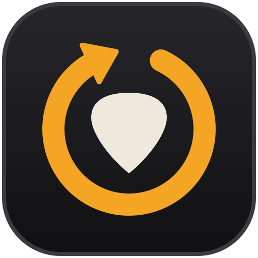
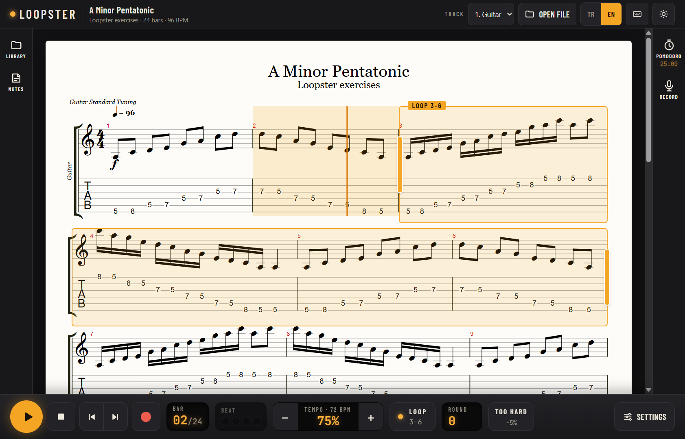

<p align="center">
  
</p>

<h1 align="center">Loopster</h1>

<p align="center">
  A tab player and practice tool for Guitar Pro files (<code>.gp5</code>, <code>.gp4</code>, <code>.gp3</code>, <code>.gpx</code>, <code>.gp</code>).<br>
  Loop the hard part, slow it down, play along with a metronome and speed up step by step.
</p>

<p align="center">
  <a href="https://github.com/ErdemTortop/Loopster/releases/latest/download/Loopster-Setup.exe"><b>Download for Windows</b></a>
  &nbsp;·&nbsp;
  <a href="https://erdemtortop.github.io/Loopster/"><b>Try it in the browser</b></a>
</p>

<p align="center"><a href="README.tr.md">Türkçe</a> · <b>English</b></p>



## Installation

1. Download [Loopster-Setup.exe](https://github.com/ErdemTortop/Loopster/releases/latest/download/Loopster-Setup.exe)
   and run it. The link always gets the latest version; earlier versions and change notes are on the
   [Releases](https://github.com/ErdemTortop/Loopster/releases) page.
2. The installer is not code-signed, so Windows SmartScreen may warn you: choose **More info → Run anyway**.
3. The installer associates `.gp`, `.gp3`, `.gp4`, `.gp5` and `.gpx` files with Loopster, so double-clicking one opens it.

The **browser version** needs no installation and is meant for trying Loopster out: it opens with an example
exercise, already looped over bars 3–6 at 75% speed, so pressing Play is all it takes. The exercise folder,
double-click opening and recordings saved as files are only in the desktop app.

## Usage

1. Click **Open a Guitar Pro file**, or drop the file anywhere on the window. No file at hand? **Try the example**
   opens the bundled exercise.
2. If the file has several instruments, pick one from the **Track** menu in the top bar.
3. Press **Play**. The note being played is highlighted and the page scrolls along.
4. Drag across the bars of the hard part: a loop envelope appears and playback repeats that range.

The sound bank (SoundFont, about 1.3 MB) loads on first playback; its progress shows in the bottom bar.

The interface is in English and Turkish. Loopster opens in your system language; switch with the **TR / EN**
buttons in the top bar and your choice is remembered.

Layout: **Library** (desktop) and **Notes** on the left, **Pomodoro** and **Record** on the right; click one to open its
panel. Tempo, metronome, speed trainer, tracks and transpose live in the **Settings** (P) shelf above the bottom bar.

### Practice tools

- **Loop envelope:** a box over the notation, like in Guitar Pro, that always wraps on whole bars. Drag across bars
  with the mouse to create it, and drag the handles on its edges to widen or narrow it (with a finger on tablets too).
  Clicking a bar moves the cursor there.
- **Tempo:** 25%–150% speed. The resulting BPM is shown; quick buttons for 50%, 75% and 100%.
- **Speed trainer:** "Every N rounds, raise the speed by X%, and stay at Y% once reached." The round and the current
  speed are shown while you play.
- **Lead-in bar:** when the loop starts over, you come in from the bar before it; later rounds still wrap to the loop start.
- **Too hard (Z):** one step slower, and the round counter starts over; the speed trainer counts again from the new speed.
- **Metronome** with volume. Two sounds: **Punchy** (strong, woodblock-like; the default) and **Classic**
  (alphaTab's own click). With **Count-in** on, one bar is counted before playback starts. The punchy sound also has an
  **Offset** setting (±30 ms): if the click reaches you before or after the note, align it there; double-click resets it.
- **Beat lights:** lights in the bottom bar that flash on every beat (brighter on the first beat of the bar). They work
  with the metronome sound off too, and can be switched off in Settings.
- **Tracks:** mute, solo and volume per instrument (0%–150% of the file's own mix; double-click for 100%).
- **View:** "Tab only" hides the notation staff (parts without tablature, such as drums, keep their notation); the
  notation size goes from 60% to 200%. Both are remembered.
- **Transpose:** in semitone steps; only the sound shifts, the tab stays the same. Useful with a capo or a lower tuning.
- **Song memory:** every song remembers its own tempo and loop, so it opens where you left off. A song you have never
  practised opens at 100% with no loop.
- **Notes:** a general note per song, plus notes tied to loop ranges (e.g. "33–40: third finger slips"). Clicking a loop
  note opens that loop.
- **Recording:** record yourself from the microphone (red button or R). Takes are listed per song with date, tempo and
  loop. You can have the tab start playing when recording starts.
- **Play along with the tab:** takes recorded while the tab was playing are played back together with the tab, with the
  tempo, loop and speed changes they were recorded with. "Take ↔ Tab" sets the balance, "Nudge" corrects microphone latency.
- **Pomodoro:** a focus / break timer (25 / 5 minutes by default). When focus time is up, playback stops, a chime sounds
  and the break begins. Start it from the Pomodoro panel on the right, where the durations are set as well.

Song memory and notes are keyed by the file's contents, so renaming a file does not lose them.

### Desktop only

- **Exercise folder:** pick a folder once, and every Guitar Pro file in it is listed in the **Library** panel on the
  left, grouped by subfolder, with a search box; one click opens a song. The folder is remembered.
- **Double-click to open:** double-clicking a Guitar Pro file opens it in Loopster; if Loopster is already running, the
  file opens in that window instead of a new one.
- **Recordings as files:** takes are written as ordinary audio files to a `Loopster Recordings` folder in Documents
  (`Loopster Kayıtları` on Turkish systems), each next to a `.json` file with its tempo, loop and timing. The folder keeps
  its name even if you switch the interface language later. "Show in folder" takes you to a file, and deleted takes go
  to the Recycle Bin. In the browser version, takes are kept in browser storage.

### Keyboard shortcuts

| Key | Action |
| --- | --- |
| Space | Play / pause |
| Esc | Stop (closes an open panel first) |
| ← / → | One bar back / forward |
| L | Loop on / off |
| Z | Too hard: one step slower, round counter reset |
| M | Metronome on / off |
| − / + | Speed down / up by 5% |
| R | Start / stop recording |
| P | Show / hide the settings |
| ? | Shortcut list |

## Development

Developed with Node.js 24 (20.19 or newer is required).

```bash
npm install
npm run dev
```

To open it in a desktop window (Electron downloads itself on the first run):

```bash
npm run desktop
```

To work on the desktop app with hot reload, while `npm run dev` runs in another terminal:

```bash
npm run desktop:dev
```

To build the Windows installer locally (written to `release/`):

```bash
npm run desktop:build
```

Checks before pushing:

```bash
npm run lint
npm run build
```

Interface text lives in `src/i18n/`: `tr.ts` defines every key and `en.ts` must provide the same ones, so a missing
translation fails the type check.

## Releases

- Every push to `main` publishes the browser version to GitHub Pages ([pages.yml](.github/workflows/pages.yml)).
- For a new desktop version, raise `version` in `package.json`, commit, then push a tag with the same number. GitHub
  Actions builds the installer on Windows and attaches it to a release ([release.yml](.github/workflows/release.yml));
  the job stops if the tag and the `package.json` version differ.

```bash
git tag v1.1.1
git push origin v1.1.1
```

Working notes (in Turkish): the [project brief](docs/PROJE_BRIEF.md) and the [idea list](docs/FIKIRLER.md).

## Built with

- [alphaTab](https://alphatab.net): reading Guitar Pro files, rendering notation and tab, MIDI playback
- React, TypeScript, Vite, Tailwind CSS
- Electron and electron-builder (desktop app)

## License

MIT. See the [LICENSE](LICENSE) file for details.

Third-party components shipped with the app come under their own licenses:

- alphaTab: Mozilla Public License 2.0
- Bravura music font (Steinberg Media Technologies): SIL Open Font License 1.1
- Sonivox SoundFont (Sonic Network): Apache License 2.0
